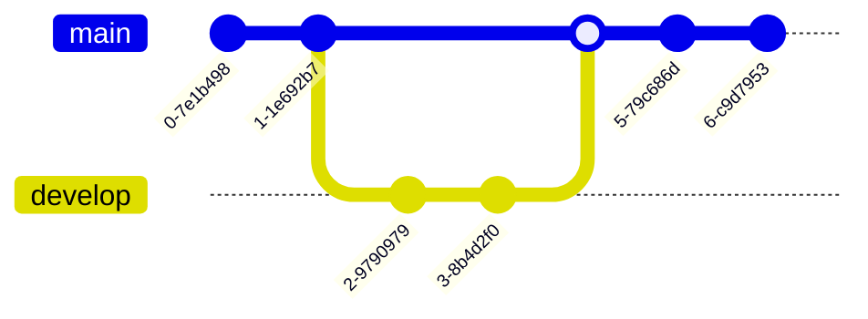

# Mi repo del curso 

Mi repo yeiii!!!

construcción local para github

CAMBIOS desde mi rama local llamada DEVELOPER01

## Git Diagrama de flujo

```mermaid
gitGraph
  commit
  commit
  branch develop
  checkout develop
  commit
  commit
  checkout main
  merge develop
  commit
  commit
```

Cambios desde el editor